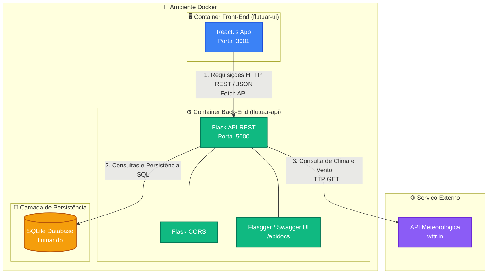

## 📐 Arquitetura da Solução

O projeto adota o **Cenário 1.1** proposto no MVP de Backend Avançado da PUC-Rio: uma Interface (Front-End) que se comunica via REST com uma API (Back-End) responsável pela persistência dos dados e pelo consumo de uma API externa.



### 🔄 Fluxo de Comunicação do Sistema

1. **Interface do Usuário (Front-End):** o painel em React envia requisições assíncronas via Fetch API para o servidor back-end.
2. **Processamento & Regras de Negócio (Back-End):** a API Flask processa os endpoints (`/clima`, `/cadastrar_aluno`, `/buscar_alunos`, `/atualizar_aluno`, `/deletar_aluno`).
3. **Persistência de Dados:** o módulo de acesso a dados comunica-se com o banco SQLite (`flutuar.db`) para armazenamento de pilotos e alunos.
4. **Integração Externa:** ao consultar condições meteorológicas, a API se conecta ao serviço externo **wttr.in** para obter dados em tempo real sobre vento e condição de voo.
## 📐 Arquitetura da Solução

O projeto adota o **Cenário 1.1** proposto no MVP de Backend Avançado da PUC-Rio: uma Interface (Front-End) que se comunica via REST com uma API (Back-End) responsável pela persistência dos dados e pelo consumo de uma API externa.

​```mermaid
graph TD
    %% Estilização de nós
    classDef client fill:#3b82f6,stroke:#1d4ed8,stroke-width:2px,color:#fff;
    classDef api fill:#10b981,stroke:#047857,stroke-width:2px,color:#fff;
    classDef db fill:#f59e0b,stroke:#b45309,stroke-width:2px,color:#fff;
    classDef ext fill:#8b5cf6,stroke:#6d28d9,stroke-width:2px,color:#fff;

    subgraph Docker_Environment [" 🐳 Ambiente Docker "]
        subgraph Frontend_Container [" 🖥️ Container Front-End (flutuar-ui) "]
            UI[React.js App<br/>Porta :3001]:::client
        end

        subgraph Backend_Container [" ⚙️ Container Back-End (flutuar-api) "]
            API[Flask API REST<br/>Porta :5000]:::api
            CORS[Flask-CORS]:::api
            SWAGGER[Flasgger / Swagger UI<br/>/apidocs]:::api
            API --- CORS
            API --- SWAGGER
        end

        subgraph Database_Storage [" 💾 Camada de Persistência "]
            DB[(SQLite Database<br/>flutuar.db)]:::db
        end
    end

    subgraph External_Services [" 🌐 Serviço Externo "]
        EXT[API Meteorológica<br/>wttr.in]:::ext
    end

    UI -->|1. Requisições HTTP REST / JSON<br/>Fetch API| API
    API -->|2. Consultas e Persistência SQL| DB
    API -->|3. Consulta de Clima e Vento<br/>HTTP GET| EXT
​```

### 🔄 Fluxo de Comunicação do Sistema

1. **Interface do Usuário (Front-End):** o painel em React envia requisições assíncronas via Fetch API para o servidor back-end.
2. **Processamento & Regras de Negócio (Back-End):** a API Flask processa os endpoints (`/clima`, `/cadastrar_aluno`, `/buscar_alunos`, `/atualizar_aluno`, `/deletar_aluno`).
3. **Persistência de Dados:** o módulo de acesso a dados comunica-se com o banco SQLite (`flutuar.db`) para armazenamento de pilotos e alunos.
4. **Integração Externa:** ao consultar condições meteorológicas, a API se conecta ao serviço externo **wttr.in** para obter dados em tempo real sobre vento e condição de voo.
