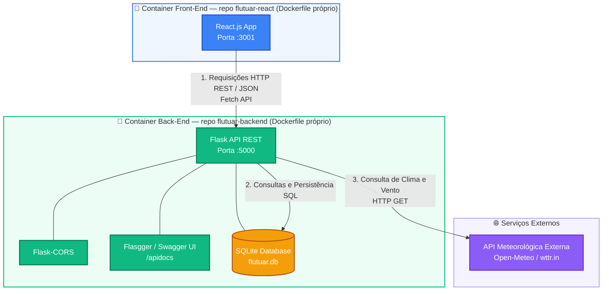

# Flutuar API - Escola de Parapente (Back-End)

A **Flutuar API** é o back-end do sistema de gestão da escola de parapente **Flutuar**, desenvolvido como parte do MVP de **Backend Avançado** da Pós-Graduação em Desenvolvimento Full Stack da PUC-Rio. A API é responsável pelo CRUD de alunos/pilotos, persistência em banco de dados SQLite e consulta de condições meteorológicas em tempo real via API externa, apoiando a decisão de voo dos instrutores.

## 🚀 Tecnologias Utilizadas

* **Python 3.10**
* **Flask** — framework web para construção da API REST
* **Flask-CORS** — liberação de acesso ao front-end (React)
* **Flasgger (Swagger UI)** — documentação interativa dos endpoints em `/apidocs`
* **SQLite** — persistência de dados
* **Requests** — consumo da API externa de clima
* **Docker** — containerização da aplicação

## 📐 Arquitetura da Solução

O projeto adota o **Cenário 1.1** proposto no MVP de Backend Avançado da PUC-Rio: uma Interface (Front-End) que se comunica via REST com uma API (Back-End) responsável pela persistência dos dados e pelo consumo de uma API externa.



### 🔄 Fluxo de Comunicação do Sistema

1. **Interface do Usuário (Front-End):** o painel em React envia requisições assíncronas via Fetch API para o servidor back-end.
2. **Processamento & Regras de Negócio (Back-End):** a API Flask processa os endpoints (`/clima`, `/cadastrar_aluno`, `/buscar_alunos`, `/atualizar_aluno`, `/deletar_aluno`).
3. **Persistência de Dados:** o módulo de acesso a dados comunica-se com o banco SQLite (`flutuar.db`) para armazenamento de pilotos e alunos.
4. **Integração Externa:** ao consultar condições meteorológicas, a API se conecta ao serviço externo **wttr.in** para obter dados em tempo real sobre vento e condição de voo.

## 🔧 Como Executar o Projeto Localmente

Certifique-se de ter o [Python 3.10+](https://www.python.org/) instalado.

1. Clone o repositório:
```bash
git clone https://github.com/cristianoricci/flutuar-backend.git
cd flutuar-backend
```

2. Crie e ative um ambiente virtual (recomendado):
```bash
python -m venv venv
source venv/bin/activate   # Linux/Mac
venv\Scripts\activate      # Windows
```

3. Instale as dependências:
```bash
pip install -r requirements.txt
```

4. Execute a aplicação:
```bash
python app.py
```

5. A API estará disponível em `http://localhost:5000`, e a documentação Swagger em `http://localhost:5000/apidocs`.

## 🐳 Como Executar via Docker

1. Construa a imagem:
```bash
docker build -t flutuar-api .
```

2. Execute o container:
```bash
docker run -p 5000:5000 flutuar-api
```

3. Acesse `http://localhost:5000/apidocs` para testar os endpoints.

## 📌 Endpoints Disponíveis

| Método | Rota | Descrição |
|---|---|---|
| `POST` | `/cadastrar_aluno` | Cadastra um novo aluno/piloto |
| `GET` | `/buscar_alunos` | Lista todos os alunos cadastrados |
| `GET` | `/buscar_aluno/<id>` | Busca um aluno específico por ID |
| `GET` | `/buscar_por_curso?curso=` | Filtra alunos por curso |
| `PUT` | `/atualizar_aluno/<id>` | Atualiza os dados de um aluno |
| `DELETE` | `/deletar_aluno/<id>` | Remove um aluno |
| `GET` | `/clima?cidade=` | Consulta condição climática para voo |

Documentação completa e interativa de todos os endpoints disponível em **`/apidocs`** (Swagger UI).

## 🌐 API Externa Utilizada

* **Serviço:** [wttr.in](https://wttr.in) — serviço público e gratuito de consulta de condições climáticas.
* **Licença/Cadastro:** serviço aberto, sem necessidade de cadastro ou chave de API.
* **Rota consumida internamente:** `https://wttr.in/{cidade}?format=j1`
* **Rota exposta pela nossa API:** `GET /clima?cidade={nome_da_cidade}`
* Os dados retornados (temperatura, velocidade e direção do vento) são **tratados e reformatados** pela nossa API antes de serem entregues ao front-end — não há redirecionamento do usuário para o serviço externo.

## 📄 Licença

Este projeto foi desenvolvido para fins acadêmicos, como parte do MVP de Backend Avançado da Pós-Graduação em Desenvolvimento Full Stack da PUC-Rio.
